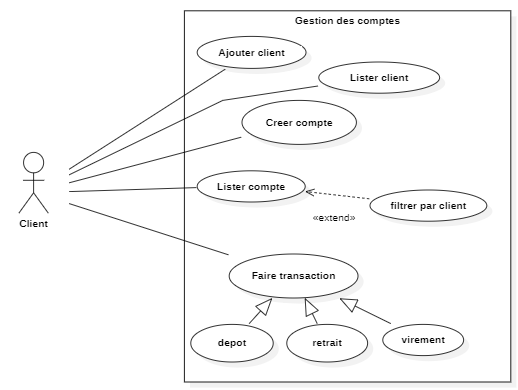
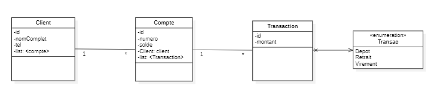

### Diagramme des Usecases


### Diagramme de classe



[Voir le document uml](sources/GestionCompte.mdj)


````code
PENSE BETE 
Quand on a une relation de one to many :
La relation la plus forte  ( le many ) va migré dans la classe la plus faible comme etant sous forme de tableau

Elle sera presenter comme telle: list:<nomDuClasseQuiALAPLUSFORTEBAIL>
Ensuite dans la cardinalité la plus forte on aura un un objet de type (nom de la classe la plus faible ) exemple :
Client:client


Quand on a des relations de type one to one , ils vont migré chaqu'un dans la classe contraire comme etant des objet et representer par : MonClasse: nomobjet

Quand on a des relations de types manyToMany, chaq'un va migrer aussi dans la classe correspondant comme etant des tableau et presenter par list:<nomClasse>
````

